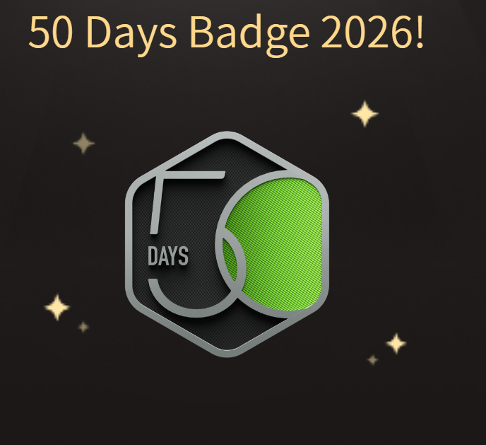
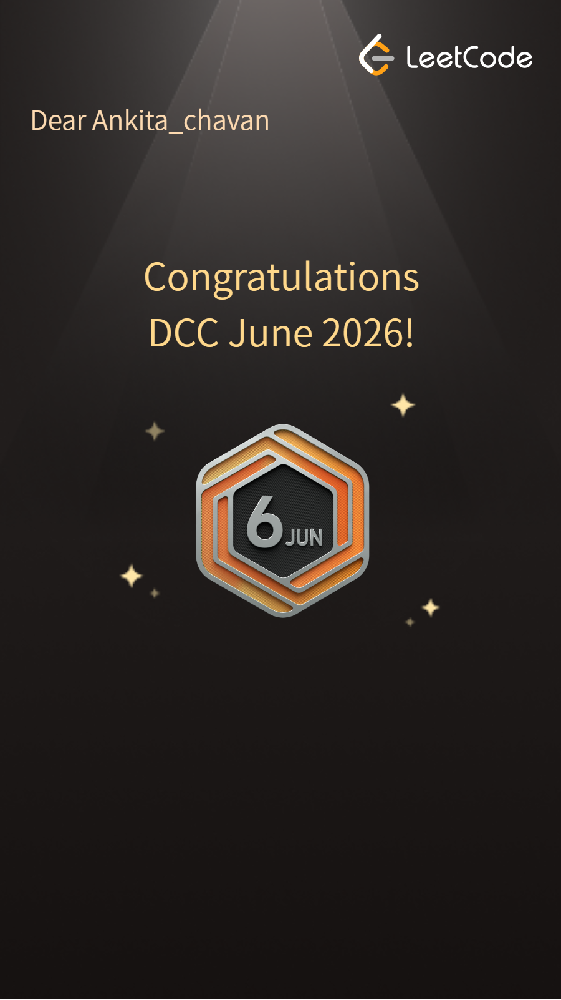

<div align="center">


# 👋 Hi, I'm Ankita Chavan

### Building intelligent software that solves real-world problems.


<br>

<a href="https://github.com/ankita12365">

</a>

<a href="https://www.linkedin.com/in/ankita-chavan-a89130357/">

</a>

<a href="https://leetcode.com/u/Ankita_chavan09/">

</a>

<a href="https://www.instagram.com/_ankuzz_01/">

</a>

</div>

---

# 💙 About Me

```yaml
Name: Ankita Chavan

Education:
  B.Tech in Computer Engineering

College:
  Vishwakarma Institute of Technology, Pune

Interested In:
  • Artificial Intelligence
  • Machine Learning
  • Full Stack Development
  • Backend Engineering
  • Cloud Computing

Current Goal:
  Building impactful AI-powered software
  while continuously improving my
  problem-solving skills.
```

---

# 🚀 What I'm Working On

- 🤖 AI-based Software Applications
- 🌐 Full Stack Web Development
- 🧠 Data Structures & Algorithms
- ⚙ Backend Systems
- ☁ Cloud Computing
- 💡 Open Source Contributions

---

# 💻 Tech Stack

### 👨‍💻 Languages

<p align="center">


</p>

---

### 🎨 Frontend

<p align="center">


</p>

---

### ⚙ Backend

<p align="center">


</p>

---

### 🗄 Database

<p align="center">


</p>

---

### 🛠 Tools

<p align="center">


</p>

---

## 🌟 Core Skills

<p align="center">


</p>

---

> **"I believe great software is built by combining curiosity, consistency, and continuous learning."**

---
# 🚀 Featured Projects

<div align="center">

### Building software that solves real-world problems through AI, Web Development, Mobile Apps, and Intelligent Systems.

</div>

---

## 🧠 Semantic Contradiction Ledger

<p align="center">


</p>

AI-powered semantic contradiction detection system that analyzes statements, detects logical inconsistencies, and improves information reliability using Natural Language Processing.

<p>


</p>

<a href="https://github.com/ankita12365/Semantic-Contradiction-Ledger">

</a>

---

## 🏥 MediSure

<p align="center">


</p>

An AI-assisted healthcare platform that simplifies medical information management and aims to improve patient accessibility through intelligent features.

<p>


</p>

<a href="https://github.com/ankita12365/MediSure">

</a>

---

## 🏀 PocketCourt

<p align="center">


</p>

A mobile application that helps users discover, book, and manage sports courts while encouraging community participation in sports.

<p>


</p>

<a href="https://github.com/ankita12365/PocketCourtApp">

</a>

---

## 🌪 Smart Disaster Evacuation Planner

<p align="center">


</p>

A graph-based disaster evacuation planner that calculates the safest evacuation routes using intelligent path-finding and dynamic risk analysis.

<p>


</p>

<a href="https://github.com/ankita12365/Smart-Disaster-Evacuation-Planner">

</a>

---

## 🍽 Smart Kitchen System

<p align="center">


</p>

An intelligent inventory management system that predicts food spoilage, tracks kitchen inventory, and recommends recipes based on available ingredients.

<p>


</p>

<a href="https://github.com/ankita12365/Smart-Kitchen-System">

</a>

---

# 💡 Areas of Interest

<div align="center">

| 🤖 AI | 🌐 Full Stack | ☁ Cloud | 📱 Mobile | ⚙ Backend |
|:----:|:-------------:|:-------:|:---------:|:---------:|
| Building intelligent systems | Modern web applications | Scalable infrastructure | Cross-platform apps | APIs & services |

</div>

---
# 🏆 Achievements

<div align="center">

### 💛 Consistency beats intensity.

<br>



&nbsp;&nbsp;&nbsp;&nbsp;&nbsp;&nbsp;



<br><br>

| Achievement | Description |
| :--- | :--- |
| 🟢 **50 Days Badge 2026** | Earned by maintaining a consistent coding streak on LeetCode. |
| 🟡 **Daily Coding Challenge - June 2026** | Successfully completed LeetCode's June Daily Coding Challenge. |

<br>

<a href="https://leetcode.com/u/Ankita_chavan09/">

</a>

</div>

---

# 🎯 Goals for 2026

<div align="center">

| 🚀 Career | 📚 Learning | 💻 Development |
| :--- | :--- | :--- |
| Secure an SDE Internship | Master System Design | Build Production-Ready Applications |
| Strengthen DSA | Learn Cloud Technologies | Explore AI & Machine Learning |
| Contribute to Open Source | Improve Backend Skills | Develop Scalable Software |

</div>

---

# 🌱 Currently Learning

<div align="center">

| Technology | Progress |
| :--- | :---: |
| 🤖 Artificial Intelligence | █████████░ 90% |
| 🌐 Full Stack Development | ██████████ 100% |
| ⚙️ Backend Development | ████████░░ 80% |
| ☁️ Cloud Computing | ██████░░░░ 60% |
| 📊 System Design | █████░░░░░ 50% |

</div>

---

# 💡 What Drives Me

```cpp
while (!success)
{
    Learn();
    Build();
    Debug();
    Improve();
    Repeat();
}
```

---

# 🌟 A Few Things About Me

- 💙 Passionate about building software that solves real-world problems.
- 🤖 Interested in Artificial Intelligence and Machine Learning.
- 🌐 Love developing Full Stack applications.
- 📚 Always learning new technologies.
- 💡 Believe consistency is the key to becoming a better developer.
- 🤝 Open to internships, collaborations, and open-source contributions.

---

# 📌 Quick Profile

```yaml
Name:
  Ankita Chavan

Role:
  Computer Engineering Student

College:
  Vishwakarma Institute of Technology, Pune

Interests:
  Artificial Intelligence
  Machine Learning
  Full Stack Development
  Backend Engineering

Looking For:
  Software Engineering Internship
  AI Projects
  Open Source Collaboration
```

---

# 📚 Favorite Quote

> **"The expert in anything was once a beginner who refused to give up."**

---
# 🤝 Let's Connect

<div align="center">

### I'm always excited to connect with developers, collaborate on projects, and learn new technologies.

<br>

<a href="https://github.com/ankita12365">

</a>

<a href="https://www.linkedin.com/in/ankita-chavan-a89130357/">

</a>

<a href="https://leetcode.com/u/Ankita_chavan09/">

</a>

<a href="https://www.instagram.com/_ankuzz_01/">

</a>

</div>

---

# 🚀 Open To

<div align="center">

| 💼 Internship | 🤝 Collaboration | 💡 Open Source | 🧠 AI Projects |
|:-------------:|:----------------:|:--------------:|:--------------:|
| ✅ | ✅ | ✅ | ✅ |

</div>

---

# 💻 Developer Philosophy

> **"Code is more than syntax—it's about solving problems, learning continuously, and building technology that makes a difference."**

---

# ⭐ Support My Work

<div align="center">

If you find any of my projects useful,

consider giving them a ⭐ on GitHub.

<br><br>

<a href="https://github.com/ankita12365?tab=repositories">

</a>

</div>

---

# 📌 Current Focus

```text
🤖 Artificial Intelligence

🌐 Full Stack Development

🧠 Machine Learning

⚙ Backend Development

☁ Cloud Computing

🚀 Building Impactful Projects
```

---

# 💙 Thanks For Visiting

<div align="center">

### Thanks for stopping by!


<br>


</div>
